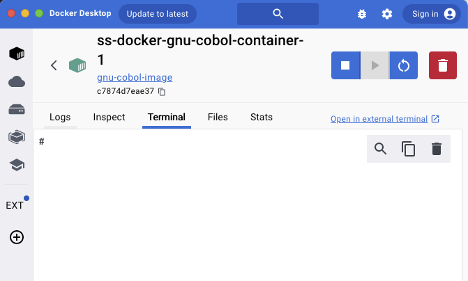

# Docker Setup for COBOL Service and CSV Uploader

This project uses Docker to build and run two services: a COBOL-based service and a Node.js-based CSV uploader.

## Prerequisites

Make sure you have Docker installed. If not, download and install Docker from [docker.com](https://www.docker.com/).

---

## Step-by-Step Guide

### 1. Build Docker Images

For each service, navigate to the corresponding folder and run the following commands to build the Docker images:

#### Build COBOL Service

In the `cobol-service` folder, run:

```bash
docker build -t gnu-cobol-image .
```

#### Build Node.js App (CSV Uploader)

In the `node-app` folder, run:

```bash
docker build -t csv-upload .
```

---

### 2. Start the Docker Containers

Navigate to the `ss-docker` folder and run the following command to start the services using Docker Compose:

```bash
docker-compose up
```

#### Network Issue?

If the containers fail to start due to network issues, create a custom network by running:

```bash
docker network create my-network
```

Then, try running Docker Compose again.

---

### 3. Interacting with Containers

Once the containers are running, you can open Docker Desktop to manage and inspect the containers.


You can interact with the containers through either a terminal or file explorer.

#### To Open a Terminal in a Container:

You can open an internal terminal or use an external terminal with the following command:

```bash
docker exec -it <container-id> /bin/sh
```

Replace `<container-id>` with the actual ID of the container you want to access.



---

### 4. Compile and Run COBOL Program

Inside the COBOL container, compile the COBOL program using the following command:

```bash
cobc -x UploadCsv.cob -o UploadCsv
```

Once compiled, run the executable:

```bash
./UploadCsv
```

The terminal output should look like this:


---

### 5. Verifying CSV Uploads

In the CSV Uploader container, you can verify the uploaded CSV file is saved in the `app/uploads` folder.


---

### 6. Test with CURL

To test the CSV upload functionality via `cURL`, you can send a POST request as follows:

```bash
curl -X POST http://csv-uploader-container:3000/upload   -H "Content-Type: multipart/form-data"   -F "file=@/workspace/UploadCsv.csv;type=text/csv"
```

This command sends the `UploadCsv.csv` file to the uploader service running in the container.

---

## Additional Notes

- Make sure Docker Desktop is running properly before executing the commands.
- The folder structure must be maintained as shown in the project to ensure successful Docker builds.
- The network configuration can be customized based on your infrastructure needs, but make sure the network is shared between both containers.
- For troubleshooting, inspect the container logs using:

```bash
docker logs <container-id>
```

---

Feel free to reach out if you encounter any issues or have questions regarding the setup.
